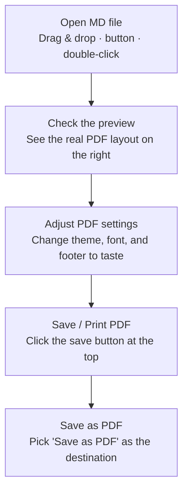
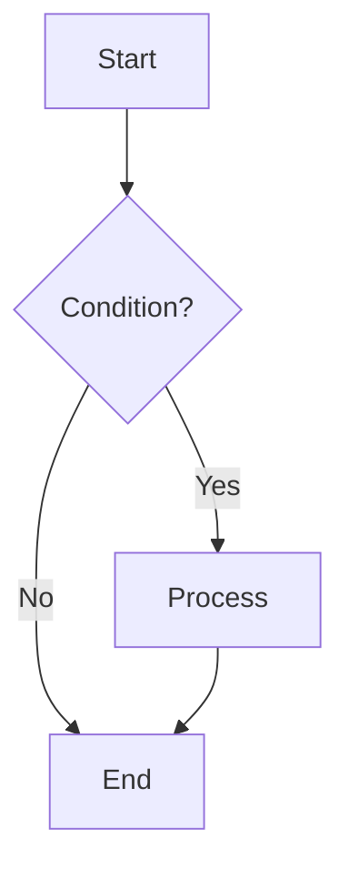
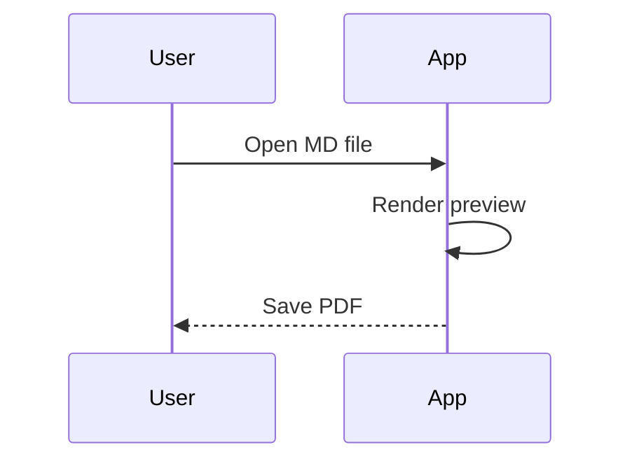
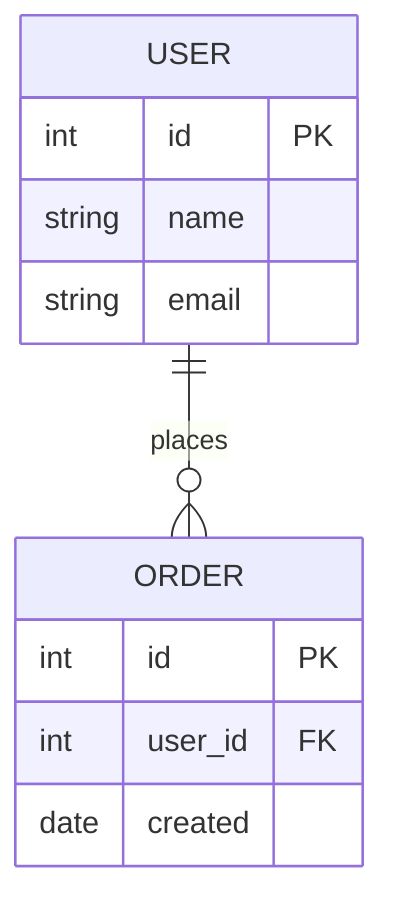

## A. MDeautify

**MDeautify** (aka *md2pdf*) is a tool that turns Markdown documents (`.md`) into **clean, page-by-page PDFs**.

No complex setup or design work required — just write in Markdown as you normally would and load the file. It automatically arranges everything neatly, from the cover to body text, tables, code blocks, and diagrams.

This guide itself was made with MDeautify. In other words, **the cover, headings, tables, code, and diagrams you see here are all real examples of "this is how it looks when you write it in Markdown."** These aren't mockups or sample images — the document you're reading *is* the actual output.

> **"Just drop in Markdown, and out comes a report-like PDF."**


## B. Basic Workflow



1. **Open MD file** — Drag a `.md` file onto the window (together with the image files if any, or the whole folder), or pick one with the `Open MD file` button. (You can also just double-click a `.md` file.)
2. **Check the preview** — The real PDF layout appears on the right, page by page.
3. **Adjust PDF settings** — Change color, font, and footer to taste under `PDF settings` at the top.
4. **Save PDF** — Click `Save / Print PDF` at the top and choose **"Save as PDF"** in the printer dialog. (See section F for details.)

## C. Exploring PDF Settings

Click the **`PDF settings`** button at the top to adjust the items below. (Close the settings window with **X, a click outside, or Esc**.)

| Setting | Description |
|---|---|
| Color theme | 8 presets + `Custom` (any color you like). Applies heading, table-header, and accent-line colors across the whole document |
| Body font | Choose between Noto Sans / Pretendard |
| Base font size | 10–20px. **The whole document scales proportionally** to this value |
| Page footer | Text at the bottom of each page. Supports the `{pageNumber}` and `{totalPages}` variables |
| Remember my settings | When on, remembers the settings below for the next launch |

**What "Remember my settings" covers**

- Remembered: color theme · body font · base font size · page footer
- Always kept separate: **Dark mode** (it's a toggle outside the settings window, so it's saved independently of this switch)

## D. Supported Markdown Syntax

From here on, we show things as **"write it like this (code on the left) → it comes out like this (result below)."**

### Headings and section badges

Heading size is set by the number of `#`. In particular, **putting a letter like `A.` or `B.` in front of a heading adds a number badge** (like the A, B, C… in this document).

```
# Largest heading
## A. Add a letter to get a badge
### Subheading
```

### Emphasis

```
**bold**, *italic*, ~~strikethrough~~, and `inline code`
```

Comes out as → **bold**, *italic*, ~~strikethrough~~, and `inline code`

> ⚠️ **Strikethrough note**: Strikethrough uses **two** tildes `~~like this~~`.
> A **single** tilde is treated as a number range (e.g., 166~169) and left as-is.

### Lists

```
- Unordered item
  - Sub-item via indentation
1. Ordered item
2. Second
```

- Unordered item
  - Sub-item via indentation
1. Ordered item
2. Second

### Tables

```
| Name | Role |
|---|---|
| Alice | Author |
| Bob | Reviewer |
```

| Name | Role |
|---|---|
| Alice | Author |
| Bob | Reviewer |

> Tip: If a table spans multiple pages, **the header row repeats automatically on the next page**.

### Code blocks

**Adding a language name (`js`, `python`, `sql`, etc.) turns on syntax highlighting.** Wrapping with just ``` and no language shows it in a single color. (That's why the "how to write" examples in this guide are single-color, while the "actual result" is colored.)

**How to write it (type this):**

````
```js
// greeting function
function hello(name) {
  const msg = "Hi, " + name;
  return 42;
}
```
````

**Actual result (shown like this — comments, keywords, strings, numbers, and function names in distinct colors):**

```js
// greeting function
function hello(name) {
  const msg = "Hi, " + name;
  return 42;
}
```

### Blockquotes and dividers

```
> This is a blockquote.

---
```

> This is a blockquote.

---

### Links

```
[MDeautify guide](https://example.com)
```

[MDeautify guide](https://example.com)

### Checklists (to-do lists)

Use `- [ ]` (empty) / `- [x]` (checked) to build a checkbox list.

```
- [x] Done
- [ ] To do
```

- [x] Done
- [ ] To do

### Images

There are three ways to add images.

**① Paste (easiest)** — Capture or copy an image and press `Ctrl+V` in the editor on the left. The image is **stored inside the document itself**, so it won't break when you move the file or open it on another PC. It's inserted at the cursor, **auto-shrunk** if wider than the page, and **automatically downsized** for very large photos to save space.

**② Drag onto the editor** — Drop an image file where you want it in the left editor and a `` reference is **inserted right at that spot**, with the badge flashing green to confirm. (Dropping onto the preview on the right adds it to the "loaded files" list instead of inserting it.)

**③ Reference an image file in the same folder** — Put the image next to the `.md` (or in a subfolder) and refer to it by filename.

```


```

With this method, images show up when you open the file one of these ways: **① drag the `.md` together with the image files (or the whole folder) onto the window**, or **② use the `Open MD file` button / double-click the `.md`.** (The program needs access to the image files, so dropping **only** the `.md` by itself won't show images — include the images too, or open via the button/double-click.)

> Note: Web URLs like `` also work.

**Resizing images** — Add ` =WxH` after the image reference to set its size.

```
   width 300 · height 200 (px)
      width 300, height auto
      height 200, width auto
       width 300
       50% of the page width
```

Even without a size, very tall images are automatically scaled down to fit the page height. (For finer control you can also write an HTML tag directly, e.g. ``.)

### Reviewing loaded files · Saving as a ZIP bundle

Click the **clip icon** above the editor (it also shows the number of loaded files) to open the **list of files attached to the current document**.

- Each image shows a status: **`✓ In use`** (referenced and shown in the body) · **`● Available`** (loaded but not yet in the body) · **`✗ Not found`** (referenced in the body but the file is missing).
- **`Insert`** button (in-use · available): inserts a `` reference at the cursor position.
- **`Remove ref`** button (not found): deletes the missing image's reference from the body.
- The **`Save ZIP`** button at the top of the list bundles **the current MD text and all loaded images into a single `.zip`**. Unzip it, keep the folder together, and open it again — the images stay linked. Handy for **backing up or handing off the document together with its images**.

### Diagrams

Draw diagrams with a `mermaid` code block. **Three types are supported: flowchart · sequenceDiagram · erDiagram.** (Any other type is shown with an "unsupported diagram" notice alongside the original code.)

**① Flowchart** — Supports direction (`TD` vertical / `LR` horizontal), branching, decision diamonds (`{ }`), and arrow labels.

````

````

Renders like this:


Node shapes: `[rectangle]` · `(rounded)` · `([stadium])` · `{diamond}` · `((circle))` / change the first line to `flowchart LR` to make it flow horizontally.

**② Sequence (sequenceDiagram)** — Shows the order of messages exchanged between participants. `-->>` is a dashed (response) arrow.

````

````

Renders like this:


**③ ER diagram (table relationships)** — Symbols like `||--o{` express the **cardinality** of a relationship. `||`=one, `o{`=zero or more (N), `|{`=one or more → e.g., `USER ||--o{ ORDER` means "one user has many orders."

````

````

Renders like this (with `1` / `0..N` shown at each end of the relationship line):


## E. Making a Cover Page

Put an info block wrapped in `---` at the **very top** of the document, and a **cover page** is created automatically (like the first page of this document).

````
---
title: Our Company Proposal
subtitle: First Half of 2026
kicker: NEW PLATFORM PROJECT
Date: 2026-07-03
Author: John Doe
---
````

- `title` and `subtitle` appear large on the cover; `kicker` is a small label at the top.
- Any other fields (Date, Author, etc.) are organized into an **info table** below the cover.

## F. Saving as a PDF

1. Click the **`Save / Print PDF`** button at the top.
2. When the print dialog opens, choose **`Save as PDF`** as the destination. (**Avoid `Microsoft Print to PDF` — it drops hyperlinks.**)
3. Click `Save`, choose a location, and you're done.

*This document was created with MDeautify.*
