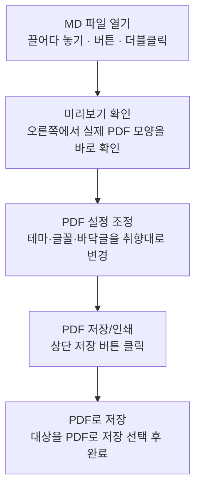
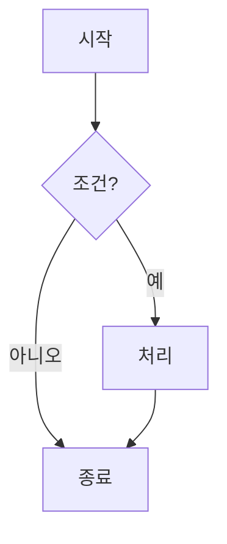
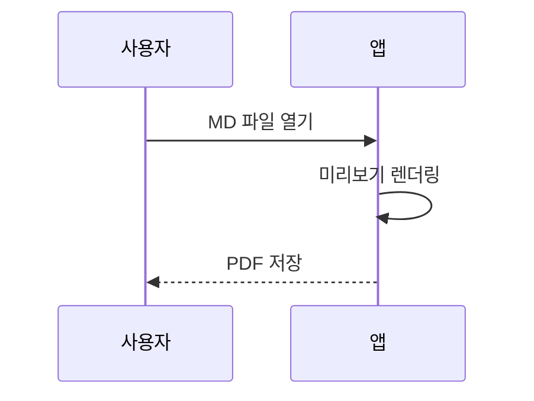
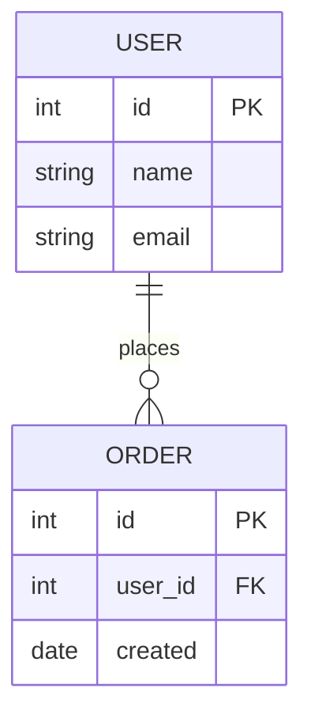

## A. MDeautify

**MDeautify**(부제 *md2pdf*)는 마크다운 문서(`.md`)를 **페이지 단위로 정돈된 PDF**로 만들어 주는 도구입니다. 

복잡한 설정이나 디자인 작업 없이, 평소처럼 마크다운으로 글을 쓰고 불러오기만 하면 됩니다. 표지부터 본문, 표, 코드 블록, 다이어그램까지 알아서 깔끔하게 배치해 줍니다.

이 안내서 또한 MDeautify로 만들어졌습니다. 즉, **여기 보이는 표지·제목·표·코드·다이어그램이 모두 "마크다운으로 작성하면 이렇게 나온다"를 보여 주는 실제 예시**입니다. 별도의 목업이나 예시 이미지가 아니라, 지금 읽고 계신 문서가 그대로 결과물인 셈입니다.

> **"마크다운만 던지면, 보고서 같은 PDF가 나옵니다."**


## B. 기본 사용 흐름



1. **MD 파일 열기** — `.md` 파일을 창에 **끌어다 놓거나**(이미지가 있으면 이미지 파일과 함께, 또는 폴더째), `MD 파일 열기` 버튼으로 고릅니다. (`.md` 더블클릭으로 열어도 됩니다.)
2. **미리보기 확인** — 오른쪽에 실제 PDF 모양이 페이지 단위로 나타납니다.
3. **PDF 설정 조정** — 상단 `PDF 설정`에서 색상·글꼴·바닥글을 취향대로 바꿉니다.
4. **PDF 저장** — 상단 `PDF 저장/인쇄`를 누르고, 프린터에서 **"PDF로 저장"** 을 고릅니다. (자세히는 F절)

## C. PDF 설정 살펴보기

상단 **`PDF 설정`** 버튼을 누르면 아래 항목을 조정할 수 있습니다. (설정 창은 **X·바깥 클릭·Esc** 로 닫힙니다.)

| 설정 | 설명 |
|---|---|
| 색상 테마 | 프리셋 8종 + `직접 선택`(원하는 색). 제목·표 머리글·강조선 색이 문서 전체에 반영 |
| 본문 폰트 | Noto Sans / Pretendard 중 선택 |
| 기준 폰트 크기 | 10~20px. **문서 전체가 이 값에 비례**해 커지고 작아짐 |
| 쪽 바닥글 | 페이지 하단 문구. `{pageNumber}` `{totalPages}` 변수 사용 가능 |
| 선택한 설정 기억하기 | 켜면 아래 설정들을 다음 실행 때도 기억 |

**"선택한 설정 기억하기"가 기억하는 범위**

- 기억함: 색상 테마 · 본문 폰트 · 기준 폰트 크기 · 쪽 바닥글
- 항상 별개로 유지: **다크 모드**(설정 창 밖의 토글이라 이 스위치와 무관하게 저장됨)

## D. 지원하는 마크다운 표기법

여기서부터는 **"이렇게 쓰면(왼쪽 코드) → 이렇게 나온다(아래 결과)"** 형식으로 보여드립니다.

### 제목과 섹션 뱃지

제목은 `#` 개수로 크기가 정해집니다. 특히 **제목 앞에 `A.` `B.` 처럼 알파벳을 붙이면 번호 뱃지**가 붙습니다 (이 문서의 A·B·C… 처럼).

```
# 가장 큰 제목
## A. 알파벳을 붙이면 뱃지가 생겨요
### 소제목
```

### 강조 표기

```
**굵게**, *기울임*, ~~취소선~~, 그리고 `인라인 코드`
```

이렇게 나옵니다 → **굵게**, *기울임*, ~~취소선~~, 그리고 `인라인 코드`

> ⚠️ **취소선 주의**: 취소선은 물결 **두 개** `~~이렇게~~` 로 씁니다.
> 물결 **하나**는 숫자 범위(예: 166~169)로 보고 그대로 둡니다.

### 목록

```
- 순서 없는 항목
  - 들여쓰기로 하위 항목
1. 순서 있는 항목
2. 두 번째
```

- 순서 없는 항목
  - 들여쓰기로 하위 항목
1. 순서 있는 항목
2. 두 번째

### 표

```
| 이름 | 역할 |
|---|---|
| 홍길동 | 작성 |
| 김철수 | 검토 |
```

| 이름 | 역할 |
|---|---|
| 홍길동 | 작성 |
| 김철수 | 검토 |

> 팁: 표가 페이지를 넘어가면 **머리글이 다음 페이지에도 자동 반복**됩니다.

### 코드 블록

**언어 이름(`js`, `python`, `sql` 등)을 붙이면 색상 강조**가 적용됩니다. 언어 없이 그냥 ``` 로만 감싸면 단색으로 표시됩니다. (그래서 이 안내서의 "작성법 예시"는 단색, "실제 결과"는 색상으로 구분됩니다.)

**작성법 (이렇게 입력):**

````
```js
// 인사 함수
function hello(name) {
  const msg = "안녕, " + name;
  return 42;
}
```
````

**실제 결과 (이렇게 표시 — 주석·키워드·문자열·숫자·함수명이 색으로 구분):**

```js
// 인사 함수
function hello(name) {
  const msg = "안녕, " + name;
  return 42;
}
```

### 인용문과 구분선

```
> 이렇게 인용문을 씁니다.

---
```

> 이렇게 인용문을 씁니다.

---

### 링크

```
[MDeautify 안내](https://example.com)
```

[MDeautify 안내](https://example.com)

### 체크리스트 (할 일 목록)

`- [ ]` (빈 칸) / `- [x]` (체크됨) 으로 체크박스 목록을 만듭니다.

```
- [x] 끝난 일
- [ ] 남은 일
```

- [x] 끝난 일
- [ ] 남은 일

### 이미지

이미지를 넣는 방법은 두 가지입니다.

**① 붙여넣기 (가장 간편)** — 캡처하거나 복사한 이미지를 왼쪽 편집기에서 `Ctrl+V`. 그림이 **문서 안에 통째로 저장**되어, 파일을 옮기거나 다른 PC에서 열어도 깨지지 않습니다. 커서 위치에 자동으로 삽입되고, 페이지 폭보다 크면 **자동 축소**, 아주 큰 사진은 용량을 위해 **알아서 줄여** 담습니다.

**② 같은 폴더의 이미지 파일 참조** — `.md` 옆(또는 하위 폴더)에 이미지를 두고 파일명으로 씁니다.

```


```

이 방식은 다음 중 하나로 열 때 이미지가 표시됩니다: **①`.md`와 이미지 파일을 함께(또는 폴더째) 창에 끌어다 놓기**, 또는 **②`MD 파일 열기` 버튼 / `.md` 더블클릭.** (프로그램이 이미지 파일에 접근할 수 있어야 하므로, `.md` **하나만** 달랑 끌어다 놓으면 이미지는 표시되지 않습니다 — 이미지와 **함께** 넣거나 버튼/더블클릭으로 여세요.)

> 참고: 웹 주소 `` 형태도 사용할 수 있습니다.

### 불러온 파일 확인 · ZIP으로 묶어 저장

편집기 위쪽의 **클립 아이콘**(불러온 파일 개수가 함께 표시됨)을 누르면 **현재 문서에 딸린 파일 목록**이 열립니다.

- 목록에는 문서(`.md`)와 이미지가 나오며, 각 이미지는 본문에서 실제로 쓰이는지에 따라 **`✓ 사용가능`** 또는 **`✗ 식별안됨`** 으로 표시됩니다.
- 이미지 옆 **`삽입`** 버튼을 누르면 편집기 커서 위치에 `` 참조가 들어갑니다.
- 목록 맨 위의 **`ZIP 저장`** 버튼을 누르면 **현재 MD 본문과 불러온 이미지 전체를 하나의 `.zip`** 으로 묶어 저장합니다. 압축을 풀어 폴더째 두고 다시 열면 이미지가 그대로 연결되므로, **문서와 이미지를 함께 보관하거나 다른 사람에게 전달할 때** 편리합니다.

### 다이어그램

`mermaid` 코드 블록으로 다이어그램을 그립니다. **지원 종류는 순서도(flowchart) · 시퀀스(sequenceDiagram) · ER(erDiagram) 세 가지**입니다. (그 외 종류는 "지원하지 않는 다이어그램" 안내와 함께 원본 코드가 표시됩니다.)

**① 순서도 (flowchart)** — 방향(`TD` 세로 / `LR` 가로), 분기, 판단 마름모(`{ }`), 화살표 라벨을 지원합니다.

````

````

이렇게 그려집니다:


노드 모양: `[사각]` · `(둥근)` · `([스타디움])` · `{마름모}` · `((원))` / 방향은 첫 줄을 `flowchart LR` 로 바꾸면 가로로 흐릅니다.

**② 시퀀스 (sequenceDiagram)** — 참여자들이 주고받는 순서를 그립니다. `-->>` 는 점선(응답)입니다.

````

````

이렇게 그려집니다:


**③ ER 다이어그램 (테이블 관계)** — `||--o{` 같은 기호로 **관계의 수(카디널리티)** 를 나타냅니다. `||`=하나, `o{`=0개 이상(N), `|{`=1개 이상 → 예: `USER ||--o{ ORDER` 는 "회원 1명이 주문 여러 건".

````

````

이렇게 그려집니다 (관계선 양끝에 `1` / `0..N` 표시):


## E. 표지(커버) 만들기

문서 **맨 위**에 `---` 로 감싼 정보 블록을 넣으면 **표지 페이지**가 자동으로 만들어집니다. (이 문서의 첫 페이지처럼요.)

````
---
제목: 우리 회사 제안서
부제: 2026년 상반기
사업명: 신규 플랫폼 구축
작성일: 2026-07-03
담당: 홍길동
---
````

- `제목` · `부제` · `사업명` 은 표지에 크게 표시됩니다.
- 그 외의 항목(작성일·담당 등)은 표지 아래 **정보 표**로 정리됩니다.

## F. PDF로 저장하기

1. 상단 **`PDF 저장/인쇄`** 버튼을 누릅니다.
2. 인쇄 창이 열리면 대상(프린터)을 **`PDF로 저장`** 으로 고릅니다. (**`Microsoft Print to PDF`는 링크가 빠지므로 피하세요.**)
3. `저장`을 누르고 위치를 정하면 완성입니다.

*이 문서는 MDeautify로 변환되었습니다.*
