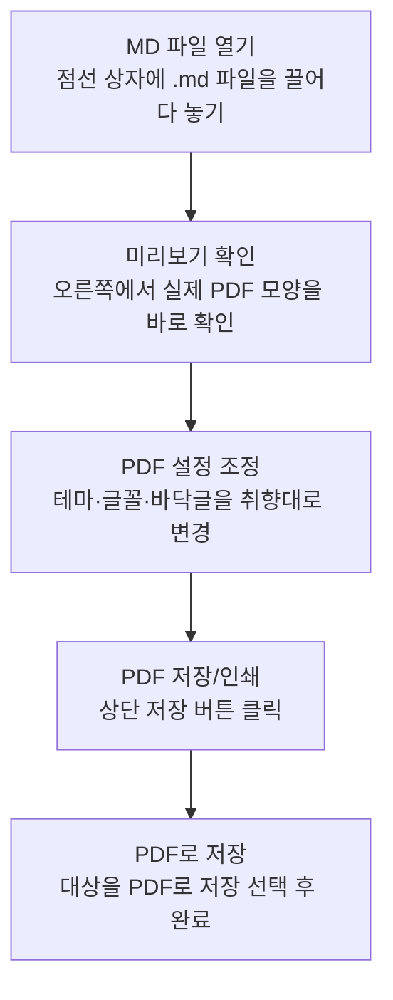
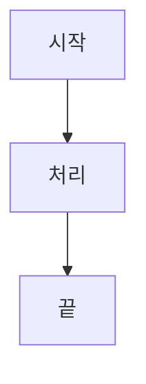
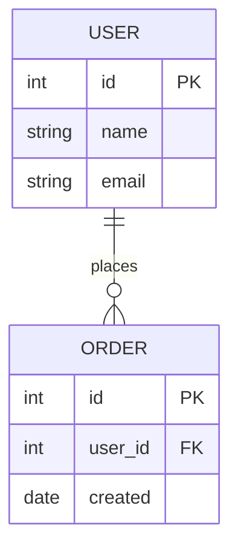

# MDeautify 사용 안내서

이 문서는 **MDeautify를 처음 접하는 분**을 위한 안내서입니다.
그리고 이 PDF 자체가 MDeautify로 만들어졌습니다 — 즉, **여기 보이는 표지·제목·표·코드·다이어그램이 전부 "마크다운으로 쓰면 이렇게 나온다"는 실제 예시**입니다.

## A. MDeautify란?

**MDeautify**(부제 *md2pdf*)는 마크다운 문서(`.md`)를 **페이지 단위로 정돈된 PDF**로 바꿔 주는 도구입니다.

- **오프라인 100%** — 인터넷 없이 동작합니다. 글꼴·변환 엔진이 전부 안에 들어 있습니다.
- **설치 불필요** — 실행 파일(exe) 하나 또는 HTML 파일 하나로 끝납니다.
- **왼쪽 원본 / 오른쪽 미리보기** — 마크다운 원문과 실제 PDF 모양을 나란히 봅니다.
- **테마·글꼴·바닥글**을 클릭 몇 번으로 바꿉니다.

> 한 줄 요약: **"메모장에 쓰듯 마크다운을 쓰면, 보고서 같은 PDF가 나옵니다."**

## B. 실행하는 3가지 방법

| 방법 | 실행 | 특징 |
|---|---|---|
| 실행 파일 | `MDeautify.exe` 더블클릭 | 가장 앱다움. 주소창 없는 독립 창 |
| 런처 | `MDeautify 실행.bat` 더블클릭 | Edge를 앱 모드로 실행 (exe 없이) |
| 브라우저 | `MDeautify_Season3.html`을 브라우저로 열기 | 가장 단순. 어디서나 동작 |

> 어느 방법이든 **화면과 기능은 동일**합니다. 평소엔 `MDeautify.exe`를 쓰시면 됩니다.

## C. 기본 사용 흐름



1. **MD 파일 열기** — 가운데 점선 상자에 `.md` 파일을 끌어다 놓거나 `MD 파일 열기` 버튼을 누릅니다.
2. **미리보기 확인** — 오른쪽에 실제 PDF 모양이 페이지 단위로 나타납니다.
3. **PDF 설정 조정** — 상단 `PDF 설정`에서 색상·글꼴·바닥글을 취향대로 바꿉니다.
4. **PDF 저장** — 상단 `PDF 저장/인쇄`를 누르고, 프린터에서 **"PDF로 저장"** 을 고릅니다. (자세히는 G절)

## D. PDF 설정 살펴보기

상단 **`PDF 설정`** 버튼을 누르면 아래 항목을 조정할 수 있습니다. (설정 창은 **X·바깥 클릭·Esc** 로 닫힙니다.)

| 설정 | 설명 |
|---|---|
| 색상 테마 | 프리셋 8종 + `직접 선택`(원하는 색). 제목·표 머리글·강조선 색이 문서 전체에 반영 |
| 본문 폰트 | Noto Sans / Pretendard 중 선택 |
| 기준 폰트 크기 | 10~20px. **문서 전체가 이 값에 비례**해 커지고 작아짐 |
| 쪽 바닥글 | 페이지 하단 문구. `{pageNumber}` `{totalPages}` 변수 사용 가능 |
| 선택한 설정 기억하기 | 켜면 아래 설정들을 다음 실행 때도 기억 |

**"선택한 설정 기억하기"가 기억하는 범위**

- 기억함: 색상 테마 · 본문 폰트 · 기준 폰트 크기 · 쪽 바닥글
- 항상 별개로 유지: **다크 모드**(설정 창 밖의 토글이라 이 스위치와 무관하게 저장됨)

## E. 지원하는 마크다운 표기법

여기서부터는 **"이렇게 쓰면(왼쪽 코드) → 이렇게 나온다(아래 결과)"** 형식으로 보여드립니다.

### 제목과 섹션 뱃지

제목은 `#` 개수로 크기가 정해집니다. 특히 **제목 앞에 `A.` `B.` 처럼 알파벳을 붙이면 번호 뱃지**가 붙습니다 (이 문서의 A·B·C… 처럼).

```
# 가장 큰 제목
## A. 알파벳을 붙이면 뱃지가 생겨요
### 소제목
```

### 강조 표기

```
**굵게**, *기울임*, ~~취소선~~, 그리고 `인라인 코드`
```

이렇게 나옵니다 → **굵게**, *기울임*, ~~취소선~~, 그리고 `인라인 코드`

> ⚠️ **취소선 주의**: 취소선은 물결 **두 개** `~~이렇게~~` 로 씁니다.
> 물결 **하나**는 숫자 범위(예: 166~169)로 보고 그대로 둡니다.

### 목록

```
- 순서 없는 항목
  - 들여쓰기로 하위 항목
1. 순서 있는 항목
2. 두 번째
```

- 순서 없는 항목
  - 들여쓰기로 하위 항목
1. 순서 있는 항목
2. 두 번째

### 표

```
| 이름 | 역할 |
|---|---|
| 홍길동 | 작성 |
| 김철수 | 검토 |
```

| 이름 | 역할 |
|---|---|
| 홍길동 | 작성 |
| 김철수 | 검토 |

> 팁: 표가 페이지를 넘어가면 **머리글이 다음 페이지에도 자동 반복**됩니다.

### 코드 블록

**언어 이름(`js`, `python`, `sql` 등)을 붙이면 색상 강조**가 적용됩니다. 언어 없이 그냥 ``` 로만 감싸면 단색으로 표시됩니다. (그래서 이 안내서의 "작성법 예시"는 단색, "실제 결과"는 색상으로 구분됩니다.)

**작성법 (이렇게 입력):**

````
```js
// 인사 함수
function hello(name) {
  const msg = "안녕, " + name;
  return 42;
}
```
````

**실제 결과 (이렇게 표시 — 주석·키워드·문자열·숫자·함수명이 색으로 구분):**

```js
// 인사 함수
function hello(name) {
  const msg = "안녕, " + name;
  return 42;
}
```

### 인용문과 구분선

```
> 이렇게 인용문을 씁니다.

---
```

> 이렇게 인용문을 씁니다.

---

### 링크

```
[MDeautify 안내](https://example.com)
```

[MDeautify 안내](https://example.com)

### 다이어그램 (선택)

`mermaid` 코드 블록으로 **순서도·시퀀스·ER 다이어그램**을 그릴 수 있습니다. 아래처럼 쓰면:

````

````

C절의 흐름도가 바로 이 방식으로 그려진 것입니다.

**ER 다이어그램(테이블 관계)** 도 그릴 수 있습니다. 아래처럼 쓰면:

````

````

이렇게 그려집니다:


## F. 표지(커버) 만들기

문서 **맨 위**에 `---` 로 감싼 정보 블록을 넣으면 **표지 페이지**가 자동으로 만들어집니다. (이 문서의 첫 페이지처럼요.)

````
---
제목: 우리 회사 제안서
부제: 2026년 상반기
사업명: 신규 플랫폼 구축
작성일: 2026-07-03
담당: 홍길동
---
````

- `제목` · `부제` · `사업명` 은 표지에 크게 표시됩니다.
- 그 외의 항목(작성일·담당 등)은 표지 아래 **정보 표**로 정리됩니다.

## G. PDF로 저장하기

1. 상단 **`PDF 저장/인쇄`** 버튼을 누릅니다.
2. 인쇄 창이 열리면 프린터(대상)를 **`PDF로 저장`** 또는 **`Microsoft Print to PDF`** 로 고릅니다.
3. `저장`을 누르고 위치를 정하면 완성입니다.

> 팁: 색상·표 배경·코드 강조는 **자동으로 인쇄**됩니다. (혹시 색이 빠져 나오면 인쇄 창의 "추가 설정 > 배경 그래픽"을 켜 주세요.)

## H. 자주 묻는 질문

**Q. 설정이 다음 실행 때 사라져요.**
A. 최신 버전에서 해결되었습니다. 오래된 exe라면 최신 실행 파일로 교체하세요.

**Q. 인터넷이 없어도 되나요?**
A. 네. 글꼴과 변환 기능이 전부 내장되어 완전히 오프라인으로 동작합니다.

**Q. 한글이 깨지지 않나요?**
A. 한글 글꼴이 내장되어 있어 그대로 잘 나옵니다.

**Q. 표의 열 너비가 이상해요.**
A. 내용에 맞춰 자동 조절됩니다. 넘치는 긴 글자는 자동으로 줄바꿈됩니다.

---

*이 문서는 MDeautify로 작성·변환되었습니다.*
